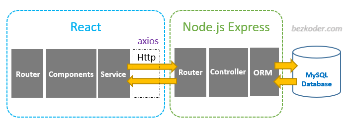

# DISEÑO DE INGENIERÍA
La ingeniería web se ha vuelto fundamental en el mundo digital de hoy, y para crear aplicaciones web robustas y escalables, es esencial contar con herramientas adecuadas. Entre los frameworks más destacados, React, Node.js y Express se destacan por sus características únicas y su popularidad en el desarrollo web moderno.

## Frameworks
### REACT-La Biblioteca de JavaScript para Interfaces de Usuario
React es una biblioteca de JavaScript desarrollada y mantenida por Facebook que se ha convertido en una de las opciones más populares para construir interfaces de usuario (UI) interactivas y dinámicas. Algunas de sus características más notables incluyen:

[Componentización] React permite dividir la interfaz de usuario en componentes reutilizables, lo que facilita la construcción y el mantenimiento de aplicaciones complejas.
[Virtual-DOM] Utiliza un Virtual DOM para actualizar eficientemente la UI, minimizando las actualizaciones en el DOM real y mejorando el rendimiento de la aplicación.
[Amplia-Comunidad] React cuenta con una comunidad activa y una amplia gama de bibliotecas y herramientas complementarias, lo que facilita la creación de aplicaciones personalizadas.

## NODE.JS-Plataforma para Construir Aplicaciones Web Rápidas y Escalables

Node.js es una plataforma de tiempo de ejecución de JavaScript que permite ejecutar código JavaScript en el lado del servidor. Algunas de sus características destacadas son:

[Eficiencia] Node.js utiliza un modelo de E/S no bloqueante que lo hace altamente eficiente y adecuado para aplicaciones en tiempo real y de alta concurrencia.
[NPM(Node-Package-Manager] Ofrece acceso a un vasto ecosistema de paquetes y módulos, lo que facilita la gestión de dependencias y el desarrollo rápido.
[Escalabilidad] Node.js es altamente escalable gracias a su modelo de eventos y su capacidad para manejar múltiples conexiones simultáneas.

## Express - Framework Minimalista para Node.js

Express es un framework minimalista para Node.js que simplifica el desarrollo de aplicaciones web y APIs. Sus características notables incluyen:

[Rutas-y-Middleware] Express ofrece un sistema de manejo de rutas y middleware que facilita la creación de rutas personalizadas y el procesamiento de solicitudes HTTP.
[Amplia-Adopción] Es ampliamente adoptado en la comunidad de desarrollo de Node.js y cuenta con una gran cantidad de complementos y extensiones disponibles.
[Flexibilidad] Express es lo suficientemente flexible como para adaptarse a una variedad de aplicaciones web, desde simples APIs hasta aplicaciones web complejas.

### ARQUITECTURA DE FRAMEWORKS

## Available Scripts

In the project directory, you can run:

### `npm start`

Runs the app in the development mode.\
Open [http://localhost:3000](http://localhost:3000) to view it in your browser.

The page will reload when you make changes.\
You may also see any lint errors in the console.

### `npm test`

Launches the test runner in the interactive watch mode.\
See the section about [running tests](https://facebook.github.io/create-react-app/docs/running-tests) for more information.

### `npm run build`

Builds the app for production to the `build` folder.\
It correctly bundles React in production mode and optimizes the build for the best performance.

The build is minified and the filenames include the hashes.\
Your app is ready to be deployed!

See the section about [deployment](https://facebook.github.io/create-react-app/docs/deployment) for more information.

### `npm run eject`

**Note: this is a one-way operation. Once you `eject`, you can't go back!**

If you aren't satisfied with the build tool and configuration choices, you can `eject` at any time. This command will remove the single build dependency from your project.

Instead, it will copy all the configuration files and the transitive dependencies (webpack, Babel, ESLint, etc) right into your project so you have full control over them. All of the commands except `eject` will still work, but they will point to the copied scripts so you can tweak them. At this point you're on your own.

You don't have to ever use `eject`. The curated feature set is suitable for small and middle deployments, and you shouldn't feel obligated to use this feature. However we understand that this tool wouldn't be useful if you couldn't customize it when you are ready for it.

